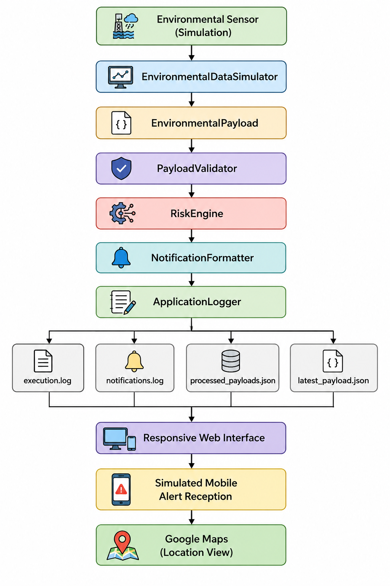
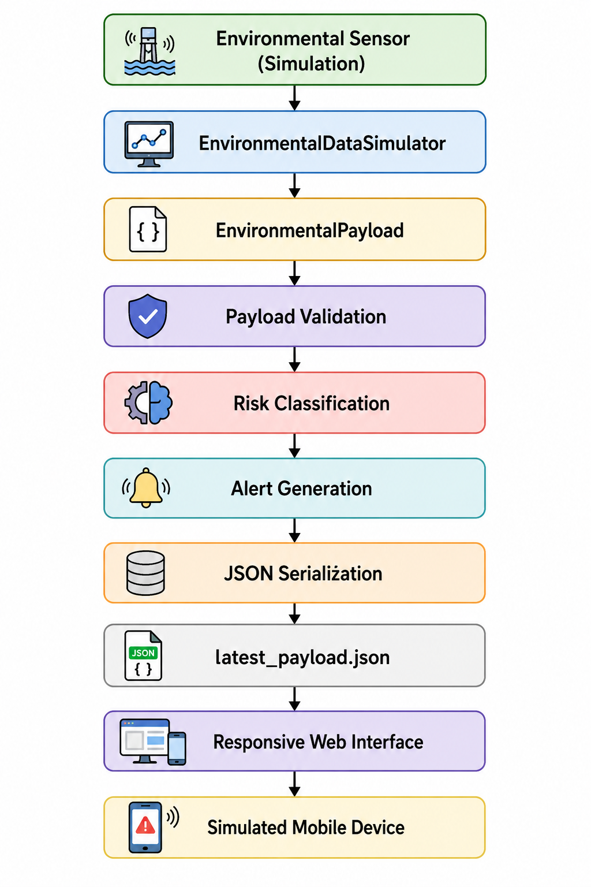
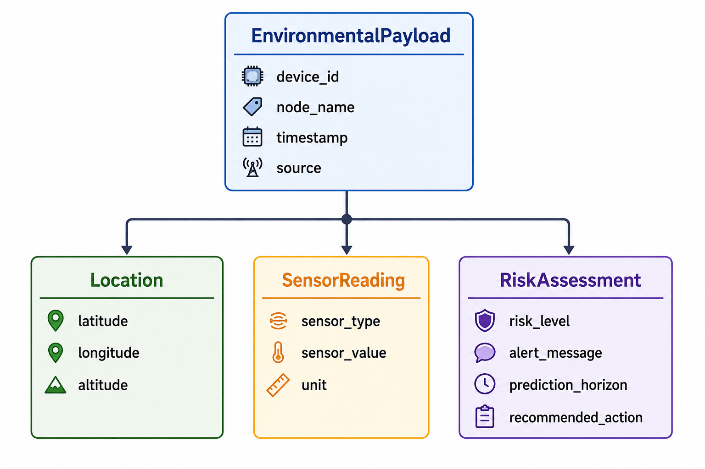
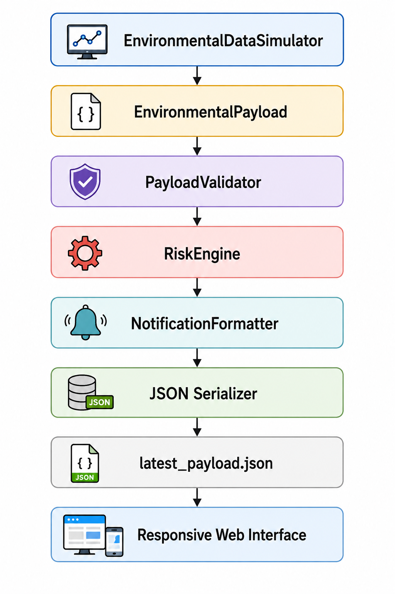
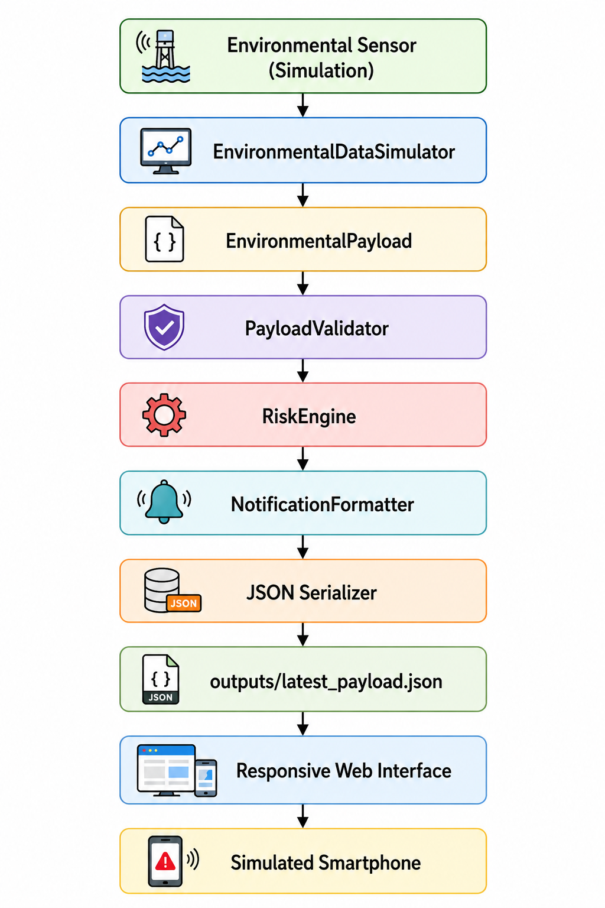
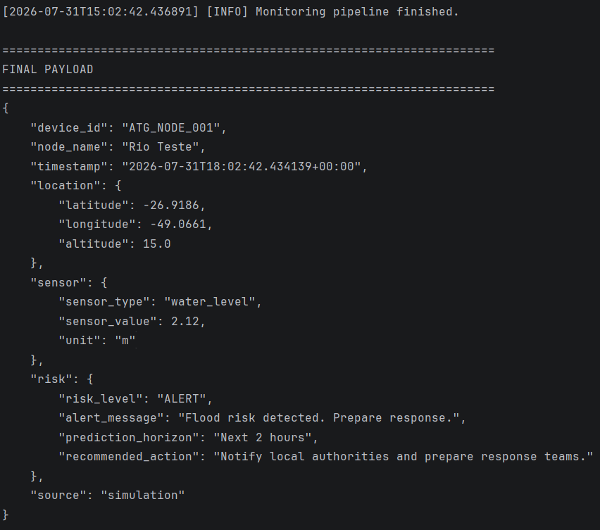
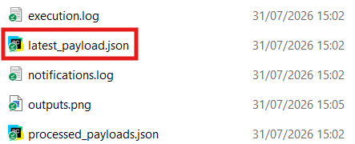
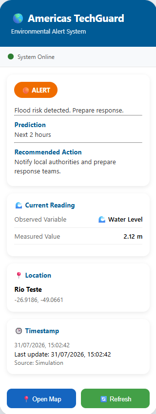
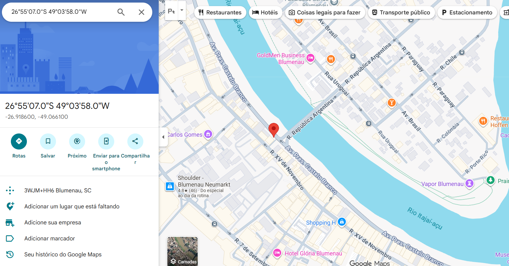

# Americas TechGuard – LoRa/Meshtastic JSON Alerts

> Proof of Concept (PoC) para monitoramento ambiental, classificação automática de risco e disseminação de alertas utilizando payloads JSON padronizados.

---

## Visão Geral

O **Americas TechGuard – LoRa/Meshtastic JSON Alerts** é uma *Proof of Concept (PoC)* desenvolvida para demonstrar uma cadeia completa de monitoramento ambiental, classificação automática de risco e disseminação de alertas a partir de uma arquitetura modular baseada em Python.

O projeto foi desenvolvido no contexto da iniciativa **100K Strong in the Americas – Americas TechGuard**, que incentiva o desenvolvimento de soluções tecnológicas para monitoramento ambiental, gestão de riscos e apoio à tomada de decisão utilizando tecnologias digitais e sistemas distribuídos.

Embora utilize dados simulados, a arquitetura foi projetada para reproduzir o comportamento de um sistema real de monitoramento ambiental baseado em sensores distribuídos, redes LPWAN (como LoRaWAN e Meshtastic) e aplicações consumidoras de payloads JSON.

Durante sua execução, a aplicação realiza automaticamente todas as etapas necessárias para transformar uma leitura ambiental em um alerta compreensível ao usuário:

- simulação de uma leitura ambiental;
- construção de um modelo de domínio estruturado;
- validação do payload;
- classificação automática do nível de risco;
- definição do horizonte temporal previsto para o evento;
- geração de recomendações de resposta;
- serialização para arquivos JSON;
- registro de evidências em arquivos de log;
- apresentação do alerta em uma interface web responsiva que simula um dispositivo móvel.

O objetivo da Proof of Concept não é implementar uma infraestrutura completa de comunicação LoRaWAN ou Meshtastic, mas demonstrar de forma funcional a camada de processamento responsável pela geração de alertas ambientais padronizados, permitindo futuras integrações com sensores físicos, gateways, APIs, serviços em nuvem e aplicações móveis.

---

# Objetivos

O objetivo deste projeto é desenvolver uma solução modular, documentada e facilmente extensível capaz de representar uma cadeia completa de monitoramento ambiental, desde a aquisição de uma leitura simulada até a apresentação de um alerta em uma interface web.

Como objetivos específicos, a solução busca:

- simular a aquisição de dados ambientais;
- estruturar as informações em um modelo de domínio orientado a objetos;
- validar automaticamente os dados recebidos;
- classificar o nível de risco ambiental utilizando regras configuráveis;
- gerar mensagens compreensíveis para usuários não especialistas;
- disponibilizar um payload JSON padronizado para futuras integrações;
- registrar evidências de execução em arquivos de log;
- apresentar o alerta em uma interface web responsiva simulando sua recepção em um smartphone.

A arquitetura foi desenvolvida seguindo princípios de modularidade, separação de responsabilidades e baixo acoplamento, permitindo que componentes atualmente simulados sejam substituídos futuramente por sensores físicos, algoritmos de previsão, modelos de Inteligência Artificial e mecanismos reais de comunicação.

---

# Motivação

Eventos hidrológicos extremos, como enchentes e inundações, representam uma ameaça recorrente para populações urbanas e rurais. Sistemas de monitoramento ambiental desempenham papel fundamental na redução de riscos ao fornecer informações antecipadas que auxiliam órgãos de defesa civil e comunidades na adoção de medidas preventivas.

Nesse contexto, redes de sensores de baixo consumo energético, como LoRaWAN e Meshtastic, têm se tornado alternativas viáveis para coleta e disseminação de informações ambientais em regiões onde a infraestrutura tradicional de comunicação é limitada.

Entretanto, independentemente da tecnologia de comunicação empregada, existe uma necessidade comum: transformar dados brutos provenientes dos sensores em informações compreensíveis, estruturadas e capazes de apoiar decisões.

Esta PoC concentra-se exatamente nessa camada lógica do sistema. A aplicação demonstra como uma leitura ambiental pode ser transformada em um alerta padronizado contendo localização, classificação de risco, horizonte temporal e recomendação de resposta, utilizando uma arquitetura modular que favorece futuras integrações com diferentes tecnologias de comunicação e plataformas de monitoramento.

# Arquitetura da Solução

A arquitetura da PoC foi desenvolvida seguindo princípios de **modularidade**, **baixo acoplamento** e **separação de responsabilidades**, permitindo que cada componente desempenhe uma função específica dentro do pipeline de monitoramento ambiental.

Embora a implementação atual utilize dados simulados, a organização da aplicação foi projetada para reproduzir a arquitetura lógica de um sistema real de alerta antecipado baseado em sensores ambientais, mecanismos de classificação de risco e aplicações consumidoras de payloads JSON.

A Figura abaixo apresenta a arquitetura geral da solução.



O pipeline inicia com a geração de uma leitura ambiental simulada. Essa leitura representa o valor observado por um sensor de nível do rio e constitui a entrada do sistema.

Em seguida, as informações são encapsuladas em uma instância da classe `EnvironmentalPayload`, que representa a entidade central do modelo de domínio e acompanha todo o fluxo de processamento.

Antes da classificação de risco, o payload é submetido ao componente `PayloadValidator`, responsável por verificar a consistência estrutural dos dados gerados.

Após a validação, o componente `RiskEngine` avalia automaticamente o valor medido pelo sensor utilizando regras de limiar configuráveis (`ThresholdRule`). Como resultado, o sistema determina:

- nível de risco;
- mensagem de alerta;
- horizonte temporal estimado para o evento;
- recomendação de resposta.

Na sequência, o `NotificationFormatter` produz uma representação textual do alerta e o `ApplicationLogger` registra todas as evidências geradas durante a execução da aplicação.

Os resultados são armazenados em quatro arquivos principais:

| Arquivo | Finalidade |
|----------|------------|
| `execution.log` | Histórico cronológico da execução da aplicação |
| `notifications.log` | Registro das mensagens de alerta produzidas |
| `processed_payloads.json` | Histórico dos payloads processados |
| `latest_payload.json` | Último payload produzido pelo pipeline |

O arquivo `latest_payload.json` desempenha papel fundamental na arquitetura da solução, pois estabelece a interface de comunicação entre o pipeline de processamento e a camada de apresentação.

A interface web desenvolvida para esta PoC realiza a leitura periódica desse arquivo, apresentando automaticamente ao usuário:

- nível de risco identificado;
- mensagem de alerta;
- variável monitorada;
- valor medido;
- localização geográfica;
- horizonte temporal previsto;
- recomendação de resposta.

Além disso, a interface disponibiliza acesso direto à localização monitorada por meio do Google Maps, demonstrando como o payload produzido pela aplicação pode ser consumido por aplicações externas sem necessidade de alterações na lógica de processamento.

Essa separação entre processamento, armazenamento e apresentação torna a arquitetura facilmente extensível, permitindo a substituição futura dos componentes simulados por sensores físicos, redes LoRaWAN, Meshtastic, brokers MQTT ou serviços em nuvem, preservando o restante da aplicação praticamente inalterado.

# Fluxo de Processamento

Durante cada execução da aplicação, o pipeline percorre automaticamente todas as etapas apresentadas a seguir.



Cada etapa possui responsabilidades bem definidas.

| Etapa | Responsabilidade |
|--------|------------------|
| Simulação | Geração da leitura ambiental |
| Modelo de Domínio | Organização das informações |
| Validação | Verificação estrutural do payload |
| Classificação | Determinação automática do nível de risco |
| Geração do Alerta | Produção das mensagens ao usuário |
| Serialização | Conversão para JSON |
| Persistência | Registro das evidências de execução |
| Interface Web | Apresentação do alerta ao usuário |

A separação das responsabilidades entre essas etapas reduz o acoplamento entre os componentes e facilita futuras evoluções da aplicação.

Por exemplo, a substituição do simulador por um sensor físico exigiria alterações apenas no módulo responsável pela aquisição dos dados, mantendo inalterados o modelo de domínio, o mecanismo de classificação de risco e a interface de apresentação.

# Modelo de Domínio

A aplicação foi desenvolvida utilizando um modelo de domínio orientado a objetos, no qual cada entidade representa um conceito específico do processo de monitoramento ambiental.

Essa abordagem permite separar claramente a lógica de negócio da infraestrutura da aplicação, tornando o código mais organizado, reutilizável e facilmente extensível.

O modelo de domínio é composto pelas entidades apresentadas nas seções a seguir.

---

## EnvironmentalPayload

A classe `EnvironmentalPayload` representa a entidade central da aplicação. Ela encapsula todas as informações produzidas pelo pipeline de monitoramento ambiental e acompanha o fluxo completo de processamento, desde a geração da leitura até a apresentação do alerta.

```text
EnvironmentalPayload

├── device_id
├── node_name
├── timestamp
├── location
├── sensor
├── risk
└── source
```

Cada instância representa um evento ambiental completo, contendo informações sobre o dispositivo de origem, localização geográfica, leitura do sensor, classificação de risco e origem dos dados.

---

## Location

A classe `Location` representa a posição geográfica associada ao evento monitorado.

```text
Location

├── latitude
├── longitude
└── altitude
```

Essas informações permitem identificar espacialmente o evento e possibilitam a integração futura com plataformas cartográficas, sistemas GIS e aplicações móveis.

---

## SensorReading

A classe `SensorReading` representa uma observação realizada por um sensor ambiental.

```text
SensorReading

├── sensor_type
├── sensor_value
└── unit
```

Na versão atual da PoC, a leitura corresponde ao nível do rio, gerado por um simulador. Entretanto, a estrutura foi projetada para suportar diferentes tipos de sensores ambientais, como pluviômetros, sensores de umidade, temperatura, qualidade da água e estações meteorológicas.

---

## RiskAssessment

A classe `RiskAssessment` representa o resultado produzido pelo mecanismo de classificação de risco.

```text
RiskAssessment

├── risk_level
├── alert_message
├── prediction_horizon
└── recommended_action
```

Após analisar a leitura ambiental, o sistema produz um alerta contendo quatro informações principais:

- **risk_level:** nível de risco identificado;
- **alert_message:** mensagem compreensível destinada ao usuário;
- **prediction_horizon:** horizonte temporal estimado para ocorrência do evento;
- **recommended_action:** ação recomendada ao usuário ou equipe responsável.

Essa estrutura aproxima a PoC da arquitetura utilizada em sistemas reais de alerta antecipado, que normalmente fornecem não apenas uma classificação, mas também informações que auxiliam a tomada de decisão.

---

## ThresholdRule

A classificação de risco é baseada em um conjunto de regras representadas pela classe `ThresholdRule`.

```text
ThresholdRule

├── minimum_value
├── risk_level
├── alert_message
├── prediction_horizon
└── recommended_action
```

Cada regra define:

- o valor mínimo necessário para sua ativação;
- o nível de risco correspondente;
- a mensagem de alerta;
- o horizonte temporal previsto;
- a recomendação de resposta.

Essa estratégia permite alterar facilmente os critérios de classificação sem necessidade de modificar a lógica principal da aplicação.

---

## RiskLevel

Os níveis de risco são representados por uma enumeração (`Enum`), garantindo maior consistência durante todo o processamento.

```text
RiskLevel

├── SAFE
├── ATTENTION
├── ALERT
└── CRITICAL
```

Cada estado representa um cenário distinto de risco ambiental.

| Nível | Descrição |
|--------|-----------|
| SAFE | Condições normais de operação. |
| ATTENTION | Situação que exige aumento do monitoramento. |
| ALERT | Possibilidade significativa de ocorrência de evento adverso. |
| CRITICAL | Situação crítica que demanda resposta imediata. |

O uso de uma enumeração evita inconsistências causadas por valores textuais espalhados pelo código e facilita futuras integrações com APIs e aplicações externas.

---

# Relacionamento entre as Entidades

O diagrama abaixo resume a organização do modelo de domínio implementado na aplicação.



O `EnvironmentalPayload` atua como agregador das demais entidades, permitindo que todas as informações relacionadas a um evento ambiental sejam tratadas como uma única unidade de processamento.

Essa organização favorece o desacoplamento entre os componentes da aplicação, simplifica a serialização para JSON e facilita futuras integrações com bancos de dados, APIs REST, aplicações móveis e sistemas distribuídos.

## Princípios de Projeto

O modelo de domínio foi desenvolvido seguindo alguns princípios fundamentais de engenharia de software:

- **Separação de responsabilidades:** cada entidade possui uma única responsabilidade bem definida.
- **Baixo acoplamento:** os componentes comunicam-se por meio de objetos de domínio e payloads JSON, reduzindo dependências diretas.
- **Alta coesão:** atributos relacionados permanecem agrupados em suas respectivas entidades.
- **Extensibilidade:** novos sensores, regras de classificação ou mecanismos de comunicação podem ser adicionados sem alterações significativas na arquitetura existente.
- **Reutilização:** o mesmo modelo de domínio é utilizado durante a simulação, processamento, serialização e apresentação dos dados.

# Modelo do Payload JSON

A comunicação entre os componentes da aplicação é realizada por meio de um payload JSON padronizado, representado pela classe `EnvironmentalPayload`.

Esse payload constitui o principal artefato produzido pelo pipeline de processamento, encapsulando todas as informações necessárias para descrever um evento ambiental e o respectivo alerta gerado pelo sistema.

Após a classificação do risco, o payload é serializado e armazenado automaticamente no arquivo:

```text
outputs/latest_payload.json
```

Esse arquivo é consumido pela interface web, que representa um dispositivo móvel recebendo o alerta produzido pelo pipeline de processamento.

---

## Estrutura Geral

O payload gerado pela aplicação possui a seguinte estrutura.

```json
{
    "device_id": "ATG_NODE_001",
    "node_name": "Rio Teste",
    "timestamp": "2026-07-30T23:40:26.431970+00:00",
    "location": {
        "latitude": -26.9186,
        "longitude": -49.0661,
        "altitude": 15.0
    },
    "sensor": {
        "sensor_type": "water_level",
        "sensor_value": 2.79,
        "unit": "m"
    },
    "risk": {
        "risk_level": "ALERT",
        "alert_message": "Flood risk detected. Prepare response.",
        "prediction_horizon": "Next 2 hours",
        "recommended_action": "Notify local authorities and prepare response teams."
    },
    "source": "simulation"
}
```

---

## Organização do Payload

A estrutura lógica do payload é apresentada abaixo.

```text
EnvironmentalPayload

├── device_id
├── node_name
├── timestamp
├── source
│
├── location
│   ├── latitude
│   ├── longitude
│   └── altitude
│
├── sensor
│   ├── sensor_type
│   ├── sensor_value
│   └── unit
│
└── risk
    ├── risk_level
    ├── alert_message
    ├── prediction_horizon
    └── recommended_action
```

Essa organização permite agrupar informações relacionadas, tornando o payload mais legível e facilitando sua utilização por aplicações consumidoras.

---

## Descrição dos Campos

### Informações do Dispositivo

| Campo | Descrição |
|--------|-----------|
| `device_id` | Identificador único do dispositivo ou nó responsável pela aquisição dos dados. |
| `node_name` | Nome amigável do ponto de monitoramento. |
| `timestamp` | Data e horário de geração do payload em formato ISO 8601 (UTC). |
| `source` | Origem das informações utilizadas durante a execução. |

Na versão atual da PoC:

```text
source = "simulation"
```

Esse campo foi incluído para garantir transparência quanto à origem dos dados utilizados durante a demonstração.

---

### Informações Geográficas

O objeto `location` identifica espacialmente o evento monitorado.

| Campo | Descrição |
|--------|-----------|
| `latitude` | Latitude em graus decimais. |
| `longitude` | Longitude em graus decimais. |
| `altitude` | Altitude em metros. |

Essas informações permitem integração direta com plataformas cartográficas, como Google Maps e sistemas GIS.

---

### Informações do Sensor

O objeto `sensor` descreve a variável ambiental observada.

| Campo | Descrição |
|--------|-----------|
| `sensor_type` | Tipo do sensor utilizado. |
| `sensor_value` | Valor observado pelo sensor. |
| `unit` | Unidade de medida da variável monitorada. |

Na versão atual da aplicação, a variável monitorada corresponde ao nível do rio.

---

### Resultado da Classificação

O objeto `risk` representa o resultado produzido pelo mecanismo de classificação automática.

| Campo | Descrição |
|--------|-----------|
| `risk_level` | Nível de risco classificado pelo sistema. |
| `alert_message` | Mensagem destinada ao usuário final. |
| `prediction_horizon` | Horizonte temporal estimado para o evento. |
| `recommended_action` | Ação recomendada ao usuário ou equipe responsável. |

Esses campos são produzidos automaticamente pelo componente `RiskEngine` com base nas regras de classificação (`ThresholdRule`).

---

## Fluxo do Payload

O payload percorre todas as etapas do pipeline de processamento.



A utilização de um payload padronizado desacopla completamente o processamento da camada de apresentação.

Como consequência, diferentes aplicações podem consumir exatamente o mesmo arquivo JSON, incluindo:

- interfaces web;
- aplicativos móveis;
- dashboards;
- APIs REST;
- brokers MQTT;
- sistemas LoRaWAN;
- redes Meshtastic;
- plataformas de monitoramento em nuvem.

Essa decisão arquitetural torna a solução facilmente extensível e reduz significativamente o impacto de futuras integrações.

## Decisão de Arquitetura

Uma das principais decisões arquiteturais desta PoC foi utilizar o arquivo `latest_payload.json` como contrato de comunicação entre o pipeline de processamento e a interface de apresentação.

Essa abordagem oferece diversas vantagens:

- desacoplamento entre backend e frontend;
- reutilização do mesmo payload por diferentes aplicações;
- facilidade para integração futura com APIs REST e serviços em nuvem;
- independência entre processamento e visualização;
- simplificação da arquitetura da demonstração.

Embora a comunicação tenha sido implementada por meio de um arquivo JSON local, a mesma estrutura poderia ser transmitida futuramente utilizando HTTP, MQTT, LoRaWAN, Meshtastic ou qualquer outro protocolo de comunicação, sem necessidade de alterações no modelo de domínio.

# Estrutura do Projeto

O projeto foi organizado em módulos independentes, cada um responsável por uma etapa específica do pipeline de monitoramento ambiental.

```text
Americas-TechGuard-Alerts/
│
├── data/
│
├── docs/
│
├── images/
│
├── outputs/
│   ├── execution.log
│   ├── notifications.log
│   ├── processed_payloads.json
│   └── latest_payload.json
│
├── src/
│   ├── domain/
│   ├── infrastructure/
│   ├── processors/
│   ├── pipeline.py
│   └── main.py
│
├── web/
│   ├── css/
│   │   └── styles.css
│   ├── js/
│   │   └── app.js
│   └── index.html
│
└── README.md
```

Cada diretório possui uma responsabilidade específica dentro da arquitetura da aplicação.

| Diretório | Responsabilidade |
|-----------|------------------|
| `data/` | Arquivos utilizados durante o desenvolvimento e testes. |
| `docs/` | Documentação complementar do projeto. |
| `images/` | Figuras utilizadas no README e na documentação. |
| `outputs/` | Arquivos produzidos automaticamente durante a execução. |
| `src/` | Código-fonte da aplicação. |
| `web/` | Interface web utilizada para demonstração do alerta. |

---

## Organização do Código-Fonte

O diretório `src/` concentra toda a lógica da aplicação.

```text
src/

├── domain/
├── infrastructure/
├── processors/
├── pipeline.py
└── main.py
```

Cada módulo possui responsabilidades bem definidas.

### domain/

Contém o modelo de domínio da aplicação.

São definidas as entidades responsáveis por representar os conceitos fundamentais do sistema, como:

- EnvironmentalPayload
- Location
- SensorReading
- RiskAssessment
- ThresholdRule
- RiskLevel

Esse módulo é independente da infraestrutura e concentra exclusivamente a representação dos dados e das regras de negócio.

---

### infrastructure/

Contém componentes de suporte utilizados pela aplicação.

Nesse módulo encontram-se elementos como:

- configuração da aplicação;
- caminhos de diretórios;
- regras de classificação;
- serialização;
- utilitários de infraestrutura.

Seu objetivo é concentrar funcionalidades auxiliares que não pertencem diretamente ao domínio.

---

### processors/

Implementa as etapas do pipeline de processamento.

Entre os principais componentes encontram-se:

- EnvironmentalDataSimulator
- PayloadValidator
- RiskEngine
- NotificationFormatter
- ApplicationLogger

Cada classe possui uma única responsabilidade, favorecendo baixo acoplamento e facilidade de manutenção.

---

### pipeline.py

Coordena toda a execução da aplicação.

Esse módulo define a sequência de processamento executada durante cada ciclo da aplicação, integrando os diferentes componentes do sistema.

---

### main.py

Representa o ponto de entrada da aplicação.

É responsável por inicializar os componentes necessários, executar o pipeline completo e apresentar o resultado final ao usuário.

---

## Interface Web

O diretório `web/` contém a aplicação responsável pela apresentação do alerta ao usuário.

```text
web/

├── css/
├── js/
└── index.html
```

Os componentes são organizados da seguinte forma.

| Arquivo | Responsabilidade |
|----------|------------------|
| `index.html` | Estrutura da interface. |
| `styles.css` | Estilização da aplicação. |
| `app.js` | Atualização automática da interface e integração com o payload JSON. |

A interface realiza a leitura periódica do arquivo `outputs/latest_payload.json`, apresentando automaticamente ao usuário todas as informações produzidas pelo pipeline de processamento.

---

## Arquivos Gerados

Durante cada execução da aplicação, são produzidos os seguintes arquivos.

| Arquivo | Finalidade |
|----------|------------|
| `execution.log` | Registro cronológico da execução da aplicação. |
| `notifications.log` | Histórico das mensagens de alerta. |
| `processed_payloads.json` | Histórico dos payloads processados. |
| `latest_payload.json` | Último payload produzido, utilizado pela interface web. |

Esses arquivos constituem as principais evidências da execução da PoC e permitem acompanhar todas as etapas do processamento.

# Tecnologias Utilizadas

A aplicação foi desenvolvida utilizando tecnologias amplamente empregadas em sistemas de monitoramento ambiental, aplicações IoT e desenvolvimento web.

| Tecnologia | Finalidade |
|------------|------------|
| Python 3 | Desenvolvimento da aplicação principal. |
| Dataclasses | Modelagem das entidades de domínio. |
| Enum | Representação dos níveis de risco. |
| JSON | Serialização e comunicação entre os componentes. |
| HTML5 | Estrutura da interface web. |
| CSS3 | Estilização da interface. |
| JavaScript | Atualização dinâmica da interface e consumo do payload JSON. |
| Google Maps | Visualização da localização monitorada. |

---

## Tecnologias Relacionadas

Embora não façam parte da implementação atual, a arquitetura foi projetada para futura integração com tecnologias como:

- LoRaWAN
- Meshtastic
- MQTT
- APIs REST
- Bancos de dados
- Plataformas em nuvem
- Aplicações móveis

A utilização de um payload JSON padronizado permite que essas integrações sejam realizadas sem necessidade de alterações significativas no modelo de domínio ou no pipeline de processamento.

# Como Executar

## Pré-requisitos

Para executar a aplicação é necessário possuir os seguintes componentes instalados:

- Python 3.10 ou superior
- Navegador Web moderno (Google Chrome, Microsoft Edge ou Mozilla Firefox)

---

## Clonando o Repositório

Clone o repositório utilizando Git.

```bash
git clone https://github.com/PatrykGoncalves/AmericasTechGuardAlerts.git
```

Acesse o diretório do projeto.

```bash
cd Americas-Techguard-Alerts
```

---

## Executando o Pipeline

Execute a aplicação principal.

```bash
python src/main.py
```

Durante a execução, a aplicação realiza automaticamente todas as etapas do pipeline:

1. simulação da leitura ambiental;
2. construção do payload;
3. validação estrutural;
4. classificação do risco;
5. geração da mensagem de alerta;
6. serialização dos resultados;
7. registro das evidências de execução.

Ao final da execução será apresentado no terminal o payload gerado.

Exemplo:

```text
======================================================================
FINAL PAYLOAD
======================================================================
{
    "device_id": "ATG_NODE_001",
    "node_name": "Rio Teste",
    "timestamp": "2026-07-31T17:42:30.490693+00:00",
    "location": {
        "latitude": -26.9186,
        "longitude": -49.0661,
        "altitude": 15.0
    },
    "sensor": {
        "sensor_type": "water_level",
        "sensor_value": 2.22,
        "unit": "m"
    },
    "risk": {
        "risk_level": "ALERT",
        "alert_message": "Flood risk detected. Prepare response.",
        "prediction_horizon": "Next 2 hours",
        "recommended_action": "Notify local authorities and prepare response teams."
    },
    "source": "simulation"
}
```

---

## Arquivos Produzidos

Após a execução serão gerados automaticamente os seguintes arquivos.

```text
outputs/

├── execution.log
├── notifications.log
├── processed_payloads.json
└── latest_payload.json
```

Cada arquivo possui uma finalidade específica.

| Arquivo | Descrição |
|----------|-----------|
| execution.log | Histórico da execução da aplicação |
| notifications.log | Registro das mensagens de alerta |
| processed_payloads.json | Histórico dos payloads gerados |
| latest_payload.json | Último payload produzido pelo pipeline |

O arquivo `latest_payload.json` será utilizado automaticamente pela interface web.

---

## Executando a Interface Web

Após executar o pipeline, inicie um servidor HTTP local.

```bash
python -m http.server
```

Abra o navegador e acesse:

```text
http://localhost:8000/web/
```

A interface realizará automaticamente a leitura do arquivo:

```text
outputs/latest_payload.json
```

Sempre que um novo payload for produzido pela aplicação, basta atualizar a página para visualizar as informações mais recentes.

---

## Fluxo Completo de Execução

A sequência de comandos para reproduzir toda a demonstração é apresentada abaixo.

```bash
python src/main.py

python -m http.server
```

Depois, abra:

```text
http://localhost:8000/web/
```

O navegador apresentará automaticamente o alerta correspondente ao último payload gerado.

# Demonstração da Solução

A Proof of Concept demonstra uma cadeia completa de monitoramento ambiental, desde a geração de uma leitura simulada até a apresentação do alerta em uma interface web responsiva.

A Figura abaixo resume o fluxo executado durante a demonstração.



Durante a demonstração, o sistema executa automaticamente todas as etapas do pipeline.

1. Uma leitura ambiental simulada é gerada.
2. O payload é construído utilizando o modelo de domínio.
3. Os dados são validados.
4. O nível de risco é classificado.
5. O sistema produz:
   - nível de risco;
   - mensagem de alerta;
   - horizonte temporal previsto;
   - recomendação de resposta.
6. O payload é serializado.
7. Os arquivos de evidência são atualizados.
8. A interface web apresenta automaticamente o alerta ao usuário.

A interface exibe:

- nível de risco;
- mensagem de alerta;
- variável monitorada;
- valor observado;
- localização geográfica;
- horizonte temporal;
- recomendação de resposta;
- data e horário da leitura.

Além disso, um botão permite abrir diretamente a localização monitorada no Google Maps.

# Resultados Obtidos

A PoC implementa com sucesso uma cadeia completa de monitoramento ambiental composta por aquisição de dados, processamento, classificação de risco e apresentação do alerta.

Durante sua execução são produzidas evidências que demonstram o funcionamento integrado da solução.

## Evidências Produzidas

- execução completa do pipeline;
- geração automática do payload JSON;
- classificação do risco ambiental;
- geração das mensagens de alerta;
- registro cronológico da execução;
- histórico dos payloads processados;
- atualização do arquivo `latest_payload.json`;
- apresentação automática do alerta na interface web;
- integração com Google Maps para visualização da localização monitorada.

A utilização de uma interface web responsiva permite representar o comportamento de um dispositivo móvel recebendo automaticamente o alerta produzido pelo pipeline de processamento.

Essa abordagem demonstra de forma integrada todas as etapas previstas na arquitetura da aplicação, desde a aquisição dos dados ambientais até sua apresentação ao usuário final.

# Capturas da Demonstração

A Figura 1 apresenta a execução do pipeline no terminal.



---

A Figura 2 apresenta o arquivo `latest_payload.json` produzido pela aplicação.



---

A Figura 3 apresenta a interface web simulando a recepção do alerta em um dispositivo móvel.



---

A Figura 4 apresenta a visualização da localização monitorada no Google Maps.



# Atendimento aos Requisitos da Atividade

A tabela abaixo relaciona os requisitos estabelecidos na proposta da atividade com os componentes implementados nesta PoC.

| Requisito | Implementação |
|-----------|---------------|
| Entrada de dados ambiental, geoespacial, meteorológica ou simulada | Simulação de nível do rio com localização geográfica |
| Etapa de processamento, previsão, inferência ou classificação | `RiskEngine` baseado em regras configuráveis (`ThresholdRule`) |
| Saída contendo nível de risco, localização e horizonte temporal | Objeto `RiskAssessment` contendo `risk_level`, `prediction_horizon` e coordenadas geográficas |
| Mensagem de alerta compreensível por usuário não especialista | Campo `alert_message` gerado automaticamente |
| Visualização do alerta em celular, interface responsiva ou ambiente equivalente | Interface Web responsiva simulando um smartphone |
| Evidências de que todas as etapas pertencem ao mesmo pipeline | Logs, payloads JSON e interface consumindo `latest_payload.json` |
| Transparência quanto à origem dos dados | Campo `source = "simulation"` presente no payload |

A solução demonstra uma cadeia funcional completa desde a geração da leitura ambiental até a apresentação do alerta ao usuário final, atendendo aos requisitos estabelecidos para a atividade.

---

# Limitações da Proof of Concept

Esta aplicação foi desenvolvida como uma Proof of Concept (PoC) com foco na demonstração da arquitetura de processamento e disseminação de alertas ambientais.

Assim, algumas funcionalidades foram propositalmente simplificadas.

Entre as principais limitações destacam-se:

- utilização de dados ambientais simulados;
- classificação baseada em regras determinísticas;
- ausência de comunicação utilizando LoRaWAN ou Meshtastic;
- inexistência de persistência em banco de dados;
- ausência de autenticação ou gerenciamento de usuários;
- atualização da interface por leitura periódica do payload JSON.

Essas limitações não comprometem os objetivos da demonstração, cujo foco consiste em apresentar uma arquitetura modular capaz de ser evoluída para cenários reais.

---

# Possíveis Evoluções

A arquitetura desenvolvida foi concebida para permitir futuras expansões sem alterações significativas no modelo de domínio.

Entre as principais possibilidades de evolução destacam-se:

## Aquisição de Dados

- integração com sensores físicos;
- integração com estações meteorológicas;
- utilização de dados hidrológicos em tempo real;
- aquisição de dados via APIs públicas.

---

## Comunicação

- transmissão utilizando LoRaWAN;
- integração com Meshtastic;
- utilização de MQTT;
- publicação por APIs REST;
- integração com serviços em nuvem.

---

## Inteligência Artificial

- previsão de enchentes utilizando séries temporais;
- classificação baseada em modelos de Machine Learning;
- estimativa probabilística de risco;
- geração automática de recomendações utilizando IA.

---

## Interface

- aplicativo Android;
- aplicativo iOS;
- dashboard web em tempo real;
- mapa interativo;
- histórico de alertas;
- gráficos temporais.

---

## Infraestrutura

- banco de dados PostgreSQL;
- Docker;
- Kubernetes;
- microsserviços;
- monitoramento utilizando Prometheus e Grafana.

---

# Conclusão

Esta PoC demonstrou a viabilidade de uma arquitetura modular para monitoramento ambiental, classificação automática de risco e disseminação de alertas utilizando payloads JSON padronizados.

Mesmo utilizando dados simulados, a solução implementa uma cadeia completa de processamento composta por aquisição dos dados, validação, classificação de risco, geração do alerta, serialização das informações e apresentação em uma interface web responsiva.

A utilização de um modelo de domínio estruturado e de um payload JSON como contrato de comunicação entre os componentes permitiu desacoplar completamente o processamento da camada de apresentação, favorecendo futuras integrações com sensores físicos, redes LPWAN, aplicações móveis e plataformas em nuvem.

A arquitetura desenvolvida demonstra que é possível construir soluções de monitoramento ambiental organizadas, extensíveis e facilmente adaptáveis para diferentes cenários de aplicação, mantendo baixo acoplamento entre seus componentes e facilitando sua evolução futura.

---

# Referências

1. 100K Strong in the Americas. Americas TechGuard Initiative.

2. LoRa Alliance. LoRaWAN® Specification.

3. Meshtastic Project. https://meshtastic.org

4. Python Software Foundation. Python Documentation.

5. JSON. Introducing JSON.

6. Mozilla Developer Network (MDN). HTML, CSS and JavaScript Documentation.

---

# Licença

Este projeto foi desenvolvido exclusivamente para fins acadêmicos no contexto da iniciativa **100K Strong in the Americas – Americas TechGuard**.

Sua utilização para fins educacionais é permitida mediante a manutenção dos créditos aos autores.

---

# Autor

**Patryk Alexandre Gonçalves**

Pesquisador em Visão Computacional  
Instituto SENAI de Inovação em Sistemas Embarcados (ISI-SE)

Projeto desenvolvido no contexto da iniciativa **100K Strong in the Americas – Americas TechGuard**.